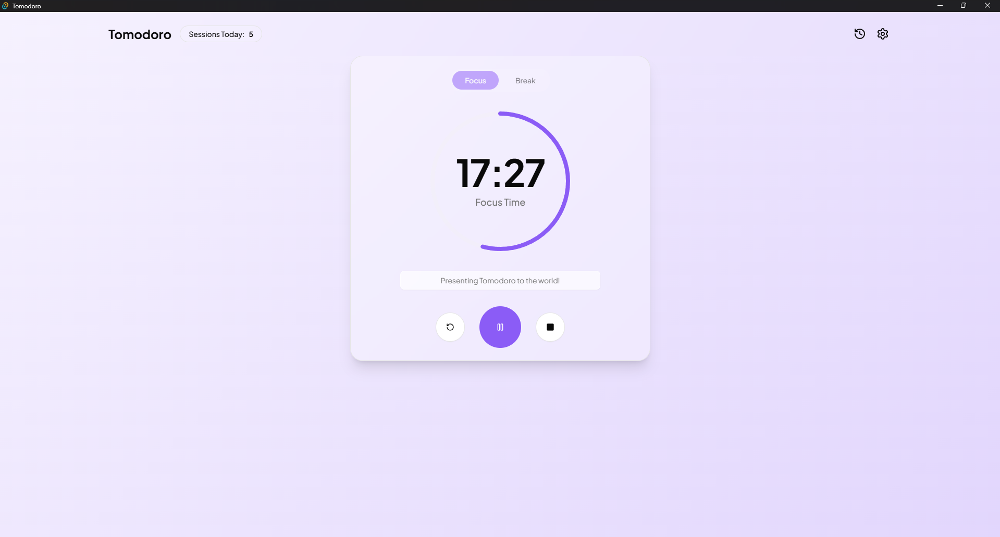

# Tomodoro

A modern, beautifully designed Pomodoro timer built with Tauri and React. Stay productive with customizable focus sessions, break reminders, and comprehensive session tracking.



## Features

### Core Pomodoro Timer

- **Focus Sessions**: Customizable duration (default 25 minutes)
- **Break Sessions**: Customizable duration (default 5 minutes)
- **Auto-switching**: Automatically transitions between focus and break modes
- **Visual Timer**: Beautiful circular progress indicator with smooth animations
- **Session Titling**: Add descriptions to your focus sessions for better tracking

### Customizable Experience

- **Theme Colors**: Personalize focus and break mode colors
- **Sound Notifications**: Choose from 5 different notification sounds
- **Multiple Sound Options**: Bell, Chime, Ding, Gong, and Notification sounds
- **Visual Feedback**: Dynamic backgrounds that change with timer mode
- **Glass Morphism UI**: Modern, clean interface with blur effects

### Session Tracking & History

- **Session History**: Complete log of all completed sessions
- **Calendar View**: Visual calendar showing days with completed sessions
- **Session Statistics**: Track total sessions and active days
- **Detailed Information**: Session duration, timestamps, and titles
- **Daily Breakdown**: View all sessions for specific dates

### Advanced Settings

- **Duration Controls**: Adjustable focus and break durations with sliders
- **Sound Testing**: Preview notification sounds before setting them
- **Color Customization**: Choose from preset color themes
- **Persistent Settings**: All preferences automatically saved
- **Real-time Updates**: Changes apply immediately

### Desktop Integration

- **Native Window**: Desktop app with native controls
- **Minimum Size**: Mobile-friendly window constraints (375px × 600px)
- **Maximized by Default**: Opens in maximized mode for better productivity
- **Cross-Platform**: Works on Windows, macOS, and Linux

## Getting Started

### Prerequisites

- [Node.js](https://nodejs.org/) (version 18 or higher)
- [pnpm](https://pnpm.io/) (recommended package manager)
- [Rust](https://rustup.rs/) (for Tauri development)

### Installation

1. **Clone the repository**

   ```bash
   git clone https://github.com/yourusername/tomodoro.git
   cd tomodoro
   ```

2. **Install dependencies**

   ```bash
   pnpm install
   ```

3. **Start development server**

   ```bash
   pnpm tauri dev
   ```

4. **Build for production**
   ```bash
   pnpm tauri build
   ```

## Development

### Project Structure

```
tomodoro/
├── src/                          # React frontend
│   ├── components/               # React components
│   │   ├── ui/                   # Shadcn/ui components
│   │   ├── timer.tsx             # Main timer component
│   │   ├── settings-sheet.tsx    # Settings panel
│   │   └── history-sheet.tsx     # Session history
│   ├── hooks/                    # Custom React hooks
│   ├── lib/                      # Utilities and types
│   └── App.tsx                   # Main application
├── src-tauri/                    # Rust backend
│   ├── src/                      # Rust source code
│   ├── icons/                    # App icons
│   └── tauri.conf.json           # Tauri configuration
└── public/sounds/                # Audio files
```

### Tech Stack

**Frontend:**

- **React 19** - Modern React with latest features
- **TypeScript** - Type-safe development
- **Vite** - Fast build tool and dev server
- **Tailwind CSS v4** - Utility-first CSS framework
- **Shadcn/ui** - Modern component library
- **Radix UI** - Accessible component primitives
- **Lucide React** - Beautiful icon library

**Backend:**

- **Tauri 2** - Rust-based desktop app framework
- **Rust** - Systems programming language
- **Type-safe IPC** - Secure frontend-backend communication

**State Management:**

- **LocalStorage** - Persistent user settings
- **Custom Hooks** - Reusable state logic
- **Jotai** - Atomic state management for UI

## Usage Guide

### Basic Timer Usage

1. **Start Session**: Click the play button to begin a focus session
2. **Add Title**: Enter what you're working on for better tracking
3. **Session Complete**: Sound notification plays, mode auto-switches to break
4. **Break Time**: Short break session begins automatically
5. **Cycle Continues**: Alternating between focus and break sessions

### Settings Customization

1. **Open Settings**: Click the settings icon in the top-right
2. **Adjust Durations**: Use sliders to set focus/break lengths
3. **Choose Colors**: Select colors for different timer modes
4. **Set Sounds**: Choose notification sounds and test them
5. **Auto-Save**: All changes are saved automatically

### Session History

1. **View History**: Click the history icon to see past sessions
2. **Calendar View**: Browse sessions by date with the calendar
3. **Session Details**: See duration, time, and titles for each session
4. **Statistics**: View total sessions and active days

## Audio Setup

The app includes a fallback beep sound system, but for the best experience, add MP3 files to `/public/sounds/`:

- `bell.mp3` - Bell notification sound
- `chime.mp3` - Gentle chime sound
- `ding.mp3` - Short ding notification
- `gong.mp3` - Meditation gong sound
- `notification.mp3` - General notification sound

**Free Sound Resources:**

- [Pixabay Sound Effects](https://pixabay.com/sound-effects/)
- [Zapsplat](https://www.zapsplat.com/)
- [Freesound](https://freesound.org/)

## Troubleshooting

### Common Issues

**App won't start:**

```bash
# Clear node_modules and reinstall
rm -rf node_modules
pnpm install
pnpm tauri dev
```

**Sound not working:**

- Check browser console for error messages
- Ensure audio files are in `/public/sounds/`
- Try the fallback beep system (built-in)

**Window size issues:**

- Minimum size is enforced at 375px × 600px
- Window starts maximized by default
- Check `src-tauri/tauri.conf.json` for window settings

### Getting Help

- **Console Logs**: Open Developer Tools (`Ctrl+Shift+I`) for debugging
- **Error Messages**: Check the terminal where you ran `pnpm tauri dev`
- **Issues**: Report bugs on GitHub Issues

## Contributing

1. Fork the repository
2. Create a feature branch (`git checkout -b feature/amazing-feature`)
3. Commit your changes (`git commit -m 'Add amazing feature'`)
4. Push to the branch (`git push origin feature/amazing-feature`)
5. Open a Pull Request

## License

This project is licensed under the MIT License - see the [LICENSE](LICENSE) file for details.

---
